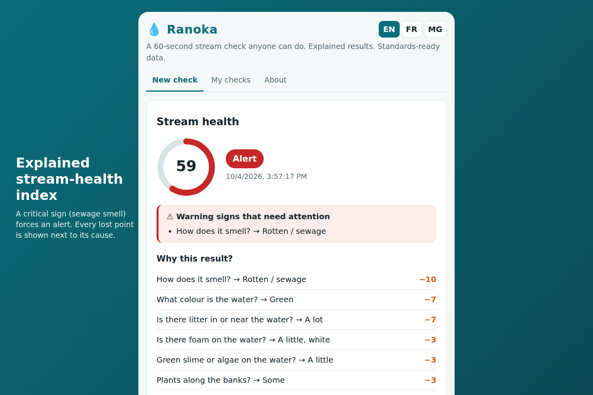
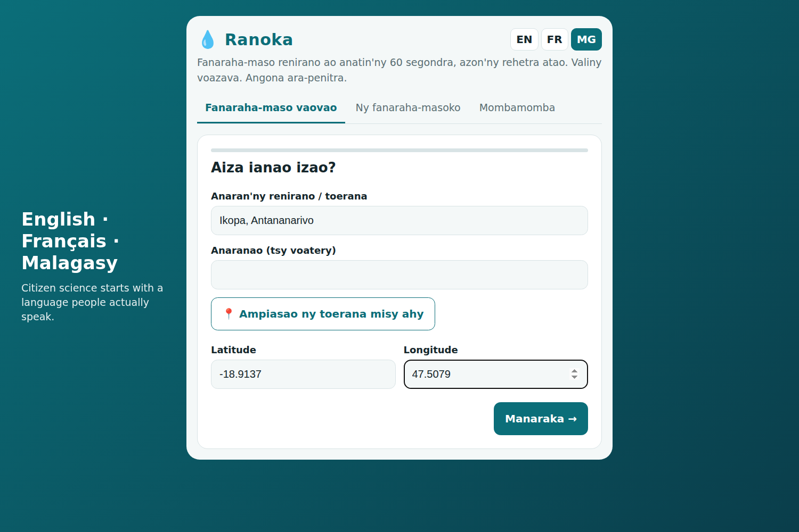
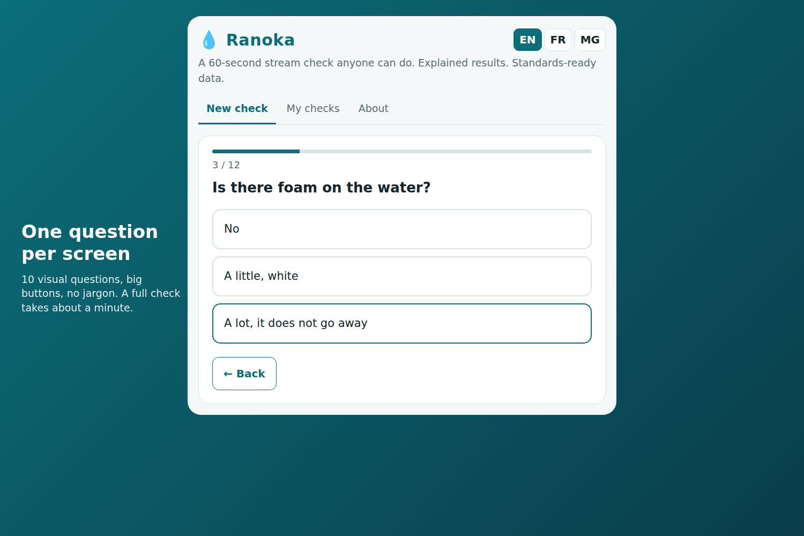
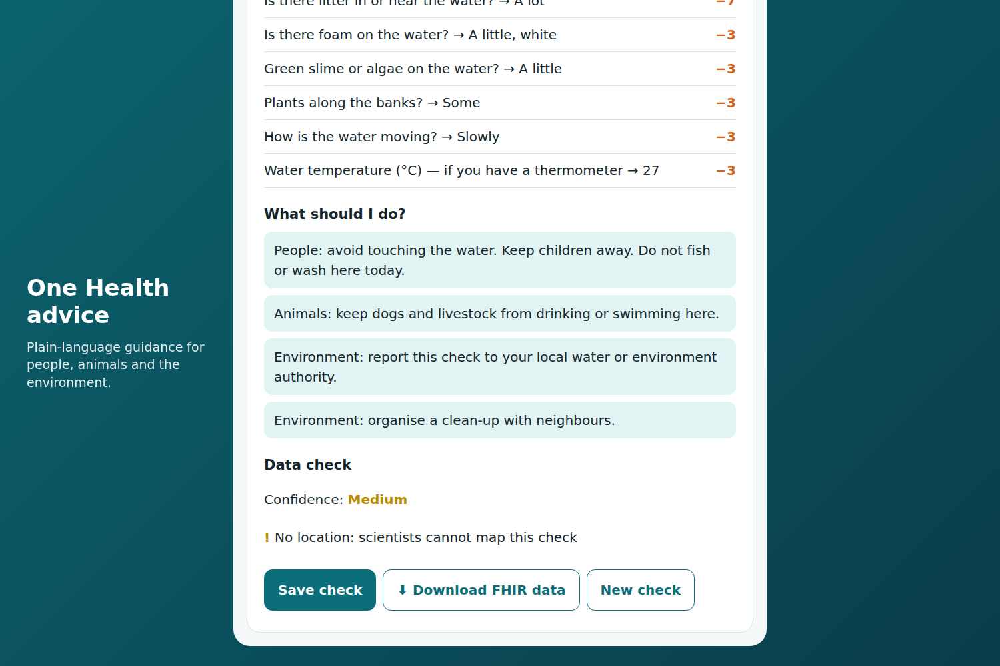
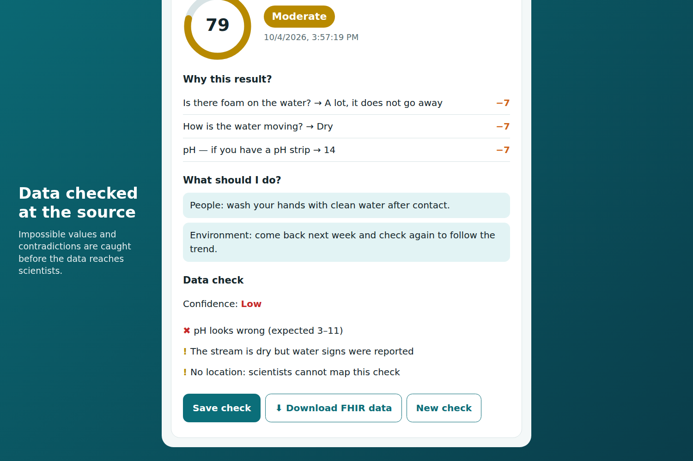
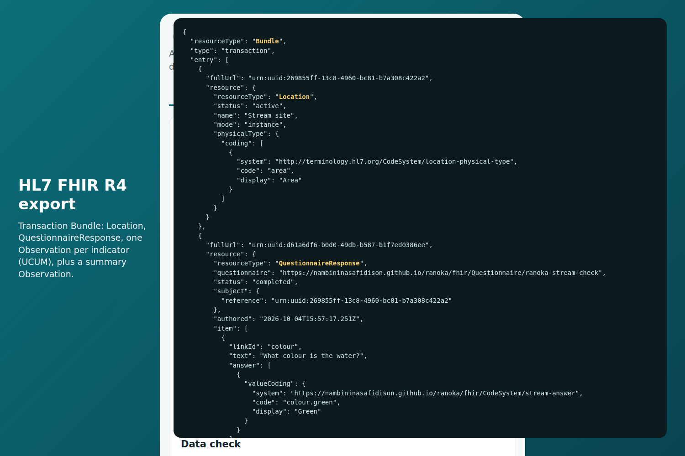
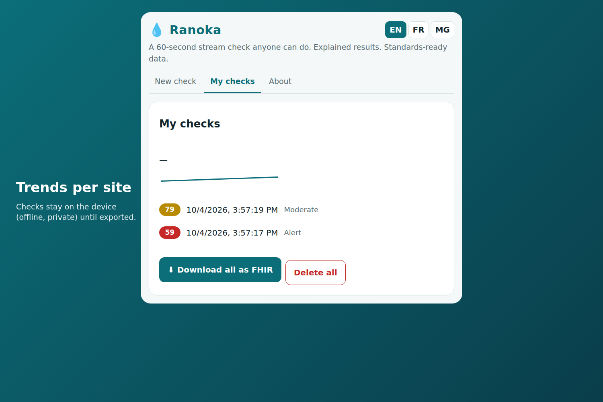

# 💧 Ranoka — 60-second citizen stream checks, explained, FHIR-ready

**OneAquaHealth IEEE Global Hackathon 2026** · Tracks: **1 (Citizen UX)**, **4 (Plain-language advice)**, **7 (Digital Health Standards)**

*Ranoka* means **"water"** in Malagasy.

Anyone can stand next to an urban stream and answer 10 visual questions in about a minute. Ranoka turns those answers into:

1. **An explained stream-health index (0–100).** The result lists every answer that cost points, so it is never a black box.
2. **One Health advice in plain language**, split into *people*, *animals* and *environment* (for example: "keep dogs away, thick algae can be toxic cyanobacteria").
3. **A data-quality check before the data reaches scientists**: missing answers, impossible pH or temperature, contradictions (a "dry" stream reported with foam or oil), missing or imprecise GPS. Each check gets a confidence of high, medium or low.
4. **HL7 FHIR R4 data**: a `transaction` Bundle with `Location`, `QuestionnaireResponse`, one `Observation` per indicator (UCUM units for °C and pH), and a summary `Observation` (stream-health index with `interpretation`, explanation and `hasMember`). The `Questionnaire` itself is generated from the same definition, so the form and the standard never drift apart.

It runs **offline**, in **English, French and Malagasy**, and keeps data **only on the device** until the user exports it. This matters for citizen scientists in the Global South, where connectivity and language are the first barriers.



| | |
|---|---|
|  |  |
|  |  |
|  |  |

## Try it

- Open `dist/index.html` in any browser (one self-contained file, no server, no install).
- Or build it from source: `node build.js`.

## Tests

```bash
node --test test/core.test.js
```

There are 11 tests. They cover scoring bounds, critical-sign overrides, explanation completeness, quality checks, FHIR Bundle structure (every `urn:uuid` reference resolves, one `value[x]` per Observation, UCUM quantities), Questionnaire coverage, and full translation coverage in all 3 languages.

## How the score works

| Indicator | Answers → penalty |
|---|---|
| Colour | clear 0 · cloudy 1 · brown 2 · green 2 · unusual 3 |
| Smell | none/earthy 0 · sewage 3⚠ · chemical 3⚠ |
| Foam | none 0 · little 1 · lots 2 |
| Oil film | no 0 · yes 3⚠ |
| Litter | none 0 · some 1 · lots 2 |
| Dead fish/animals | no 0 · yes 4⚠ |
| Algae | none 0 · some 1 · thick mat 3⚠ |
| Bank vegetation | natural 0 · partial 1 · bare/concrete 2 |
| Flow | flowing 0 · slow 1 · stagnant/dry 2 |
| Invasive species | no/unsure 0 · yes 1 |
| Temperature (opt.) | ≤25 °C 0 · >25 1 · >30 2 |
| pH (opt.) | 6.5–8.5 0 · 6–6.5/8.5–9 1 · otherwise 2 |

`index = 100 − 100 × penalty / 29`. The levels are good ≥ 80, moderate ≥ 60, poor ≥ 40, and alert below that. **Any ⚠ sign forces "alert"** whatever the total: a single dead fish matters more than an average.

## Files

- `src/core.js`: questionnaire, scoring, quality checks, FHIR export (no dependencies, works in the browser and in Node).
- `src/i18n.js`: EN / FR / MG strings.
- `src/app.js`, `src/index.html`: mobile-first UI.
- `build.js` → `dist/index.html` (single file) and `dist/questionnaire.json` (FHIR Questionnaire).

## Limits and next steps

- The canonical URLs and code systems are project-local. The next step is to map them to the OneAquaHealth FHIR IG profiles and to validate the output with the HL7 validator.
- The penalty weights are expert-chosen defaults. With paired lab samples they can be calibrated per city.
- Next features: photo attachments (`Media`), a sync queue to a FHIR server, and a map of all checks for a city.
